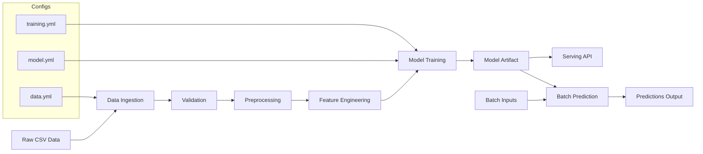

# Customer Sales Prediction System

SalesPulse ML is a production‑ready customer sales prediction system that ingests raw sales data, validates and preprocesses it, builds features, trains a model, and serves predictions through a simple API. The project includes pipelines for training and batch inference, reproducible configs, and saved artifacts for deployment, making it easy to iterate from experimentation to reliable, real‑world usage.

## System Architecture



## 1) Setup

```powershell
python -m venv .venv
.\.venv\Scripts\Activate.ps1
pip install -r requirements.txt
```

## 2) Put your data

Place your CSV at:
```
- `data/raw/customer_sales_prediction_dataset.csv`
```
Expected target column (configurable): `monthly_sales`

## 3) Train

```powershell
python -m pipelines.train_pipeline --config configs/training.yaml
```

Artifacts are written to `artifacts/`.

## 4) Batch predict

```powershell
python -m pipelines.inference_pipeline --config configs/training.yaml --input data/raw/customer_sales_prediction_dataset.csv --output data/processed/predictions.csv
```

## 5) Serve (FastAPI)

```powershell
uvicorn src.serving.api:app --reload --port 8000
```

Then POST to `http://127.0.0.1:8000/predict`.


```
ml-system/
├── data/
│   ├── raw/
│   ├── processed/
│   └── features/
├── configs/
│   ├── data.yaml
│   ├── model.yaml
│   └── training.yaml
├── src/
│   ├── data/
│   ├── features/
│   ├── models/
│   ├── serving/
│   └── monitoring/
├── pipelines/
├── tests/
├── docker/
scripts/
├── train.py
├── serve.py
├── batch_predict.py

├── requirements.txt
├── pyproject.toml
└── README.md


```

