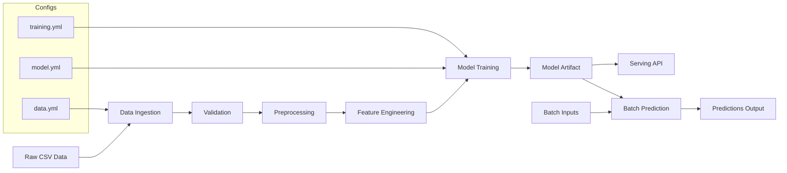

# Customer Sales Prediction System

SalesPulse ML is a production‑ready customer sales prediction system that ingests raw sales data, validates and preprocesses it, builds features, trains a model, and serves predictions through a simple API. The project includes pipelines for training and batch inference, reproducible configs, and saved artifacts for deployment, making it easy to iterate from experimentation to reliable, real‑world usage.


## System Architecture



## 1) Setup

```powershell
python -m venv .venv
.\.venv\Scripts\Activate.ps1
pip install -r requirements.txt
```

## 2) Put your data

Place your CSV at:
```
- `data/raw/customer_sales_prediction_dataset.csv`
```
Expected target column (configurable): `monthly_sales`

## 3) Train

```powershell
python -m pipelines.train_pipeline --config configs/training.yaml
```

Artifacts are written to `artifacts/`.

## 4) Batch predict

```powershell
python -m pipelines.inference_pipeline --config configs/training.yaml --input data/raw/customer_sales_prediction_dataset.csv --output data/processed/predictions.csv
```

## 5) Serve (FastAPI)

```powershell
uvicorn src.serving.api:app --reload --port 8000
```

Then POST to `http://127.0.0.1:8000/predict`.


```
customer sales prediction system/
├── artifacts/
│   ├── customer_sales_prediction.joblib
│   └── metadata.json
├── configs/
│   ├── data.yml
│   ├── model.yml
│   └── training.yml
├── data/
│   ├── raw/
│   │   └── customer sales prediction dataset.csv
│   ├── test/
│   │   └── test.csv
│   └── train/
│       └── train.csv
├── docker/
│   └── Dockerfile
├── pipelines/
│   └── train_pipeline.py
├── scripts/
│   ├── batch_predict.py
│   ├── serve.py
│   └── train.py
├── src/
│   ├── __init__.py
│   ├── data/
│   │   ├── __init__.py
│   │   ├── ingetion.py
│   │   ├── preprocessing.py
│   │   └── validation.py
│   ├── features/
│   │   ├── __init__.py
│   │   └── build_features.py
│   ├── models/
│   │   ├── __init__.py
│   │   ├── evaluate.py
│   │   └── train_model.py
│   └── serving/
│       ├── __init__.py
│       ├── api.py
│       └── schemas.py
├── tests/
│   ├── test_data.py
│   ├── test_features.py
│   ├── test_model.py
│   └── test_serving.py
├── customer sales.ipynb
├── pyproject.toml
├── README.md
└── requirements.txt
```

